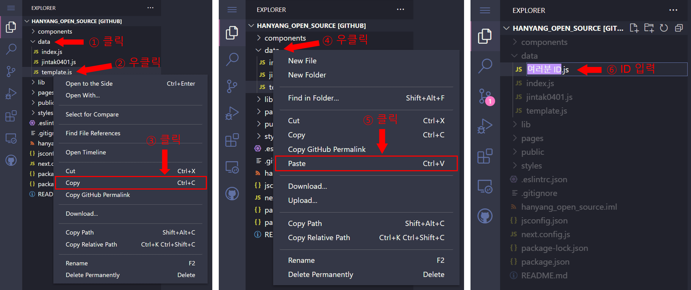

# 한양오픈소스 프로젝트

프로젝트 결과물은 [이 곳](https://hanyang-open-source.vercel.app/) 에서 확인할 수 있습니다.

## 목차
- [이 프로젝트는 뭔가요?](#이-프로젝트는-뭔가요)
- [어떻게 참여하나요?](#어떻게-참여하나요)
  - [1. fork 하기](#1.-fork-하기)
  - [2. branch 생성하고 변경하기](#2.-branch-생성하고-변경하기)
     - [2-1. 웹에서 branch 생성하고 변경하기](#2-1.-웹에서-branch-생성하고-변경하기)
     - [2-2. 로컬에서 branch 생성하고 변경하기](#2-2.-로컬에서-branch-생성하고-변경하기)
  - [데이터 추가하기](#데이터-추가하기)
  - [commit 하기](#commit-하기)
    - [웹에서 commit 하기](#웹에서-commit-하기)
    - [로컬에서 commit & push 하기](#로컬에서-commit--push-하기)
  - [Pull Request](#pull-request)
- [어디에서 어떻게 확인하나요?](#어디에서-어떻게-확인하나요)
- [이 외에 어떻게 기여하나요?](#이-외에-어떻게-기여하나요)
---
## 이 프로젝트는 뭔가요?

이 프로젝트는 한양대학생분들이 오픈소스에 대한 막연한 두려움을 없애고 쉽게 참여할 수 있도록 만든 간단한 프로젝트입니다.
`data/` 디렉토리에 여러분이 쓰고 싶은 글을 template에 맞게 작성하여 PR(Pull Request)을 보내면 관리자가 승인하면
이 프로젝트에 기여하게 됩니다.


**참여해주신 분들이 작성한 글들을 [이 곳](https://hanyang-open-source.vercel.app/) 에서 검색하여 볼 수 있습니다.**

---
## 어떻게 참여하나요?

### 1. fork 하기


`jintak0401/hanyang_open_source`에서 우측의 fork 버튼을 눌러서 여러분의 repository에 `hanyang_open_source`를 여러분 repository에 fork하세요.

### 2. branch 생성하고 변경하기

웹으로 참여하실 분들은 [웹에서 branch 생성하고 변경하기](#웹에서-branch-생성하고-변경하기)를, 
로컬에서 참여하실 분들은 [로컬에서 branch 생성하고 변경하기](#로컬에서-branch-생성하고-변경하기)를 참고해주세요.

#### 2-1. 웹에서 branch 생성하고 변경하기


위 순서대로 branch를 생성하세요. "브랜치이름"으로 branch를 만들라는게 아닙니다! 원하는 이름으로 branch를 만드세요.
그러면 새 branch가 생성되어 url이 `https://github.com/HashDigest/hanyang_open_source/tree/브랜치이름` 일 것입니다.


그 url에서 `.com`을 `.dev`으로 변경해주세요. 그러면 위 그림과 같은 웹 에디터를 보실 수 있습니다.
이제 [데이터 추가하기](#데이터-추가하기)로 가서 파일을 추가하세요

#### 2-2. 로컬에서 branch 생성하고 변경하기


위를 참고하여 fork한 repository의 url을 복사하세요. 
아마 복사된 주소는 `https://github.com/여러분ID/hanyang_open_source` 일 것입니다.


그리고 터미널에서 위의 명령어를 입력하여 clone과 branch 생성 및 변경을 진행해주세요. branch 이름을 브랜치이름으로 하라는게 아닙니다!
원하는 branch 이름으로 branch를 만들어주세요.

```shell
// repository를 local에 clone
$ git clone https://github.com/여러분ID/hanyang_open_source

// hanyang_open_source 디렉토리로 이동
$ cd hanyang_open_source

// branch 생성 및 변경
$ git checkout -b 브랜치이름

// branch 생성과 변경을 따로 하고 싶다면
$ git branch 브랜치이름
$ git checkout 브랜치이름
```

clone한 hanyang_open_source 프로젝트를 원하는 IDE로 열어주세요.

### 데이터 추가하기


`data/`디렉토리를 보시면 `template.js`라는 파일이 있습니다. 이 파일을 복사해서 `여러분ID.js` 파일을 만들어주세요.


그리고 `여러분ID.js` 파일에 쓰고 싶은 글의 제목과 본문을 작성하세요. 다 작성하셨으면, `data/index.js`에 위와 같이 작성해주세요.
만약 ID가 wlsxkr77라면, 아래처럼 작성되어야 합니다.
```javascript
// data/wlsxkr77.js
const content = {
    title: '제목',
    body: `본문`
};

export default content;
```

```javascript

// data/index.js
...
import wlsxkr77 from './wlsxkr77';
...

export {
    ...
    wlsxkr77,
    ...
}
```

### commit 하기

웹으로 참여하시는 분들은 [웹에서 commit 하기](#웹에서-commit-하기)를,
로컬에서 참여하시는 분들은 [로컬에서 commit & push 하기](#로컬에서-commit--push-하기)를 참고해주세요.

#### 웹에서 commit 하기


그리고 위의 순서대로 커밋 메시지를 작성하고 커밋하세요.
`https://github.com/HashDigest/hanyang_open_source/tree/브랜치이름` 에 돌아가셔서 확인해보시면 작성하신 파일이 `data/`디렉토리에 반영되어 있을 것입니다.
[Pull Request](#pull-request)로 가서 PR을 보내세요.

#### 로컬에서 commit & push 하기


위와 같이 명령어를 쳐서 remote repository에 현재 branch에서 추가한 데이터를 반영하세요.

```shell
// 현재 디렉토리에서 commit될 파일들 추가
$ git add ./

// commit 메시지 작성
$ git commit -m "커밋 메시지 작성"

// remote repository에 변경사항 반영
$ git push origin 브랜치이름
```

### Pull Request

`https://github.com/여러분ID/hanyang_open_source` 으로 가면 여러분이 추가한 파일들이 새로 만든 branch에 반영되어 있을 겁니다.
이제 그 추가사항들을 여러분이 fork하신 원래의 repository에 반영해달라고 요청(Pull Request)해야합니다.


위처럼 정해진 양식에 맞게 수정하고 `Create pull request`를 눌러주시면 끝입니다!

---

## 어디에서 어떻게 확인하나요?

여러분들이 작성하신 글은 [이 곳](https://hanyang-open-source.vercel.app/) 에서 확인할 수 있습니다.


여러분이 `data/`디렉토리에 추가할 때 쓰셨던 ID를 검색하면 오른쪽과 같이 글을 볼 수 있습니다.

---

## 이 외에 어떻게 기여하나요?

이 외에도 기여하려고 하신다니... 정말 감사드립니다. 데이터 추가 외에 기여하실 수 있는 방법은 다음과 같습니다.

>1. 에러, 버그를 제보
>2. 코드를 수정, 추가하여 사이트 기능 및 디자인 개선

간단한 사이트이지만, 모든 디바이스와 환경에서 테스트를 해보지 않아 버그나 에러가 있을 수 있습니다.
그래서 에러나 버그를 `https://github.com/jintak0401/hanyang_open_source/issues` 에서 `New issue`를 이용해서 제보해주시면 감사하겠습니다.

또 현재 페이지는 디자인도 많이 부족하고, 큰 기능이 없는 상태입니다.
여러분의 아이디어나 디자인 실력으로 이 사이트를 개선하고 싶으시다면 코드를 수정, 추가하신 후에 `feature` branch로 PR을 보내주세요.
최대한 많이 반영하도록 하겠습니다. 
